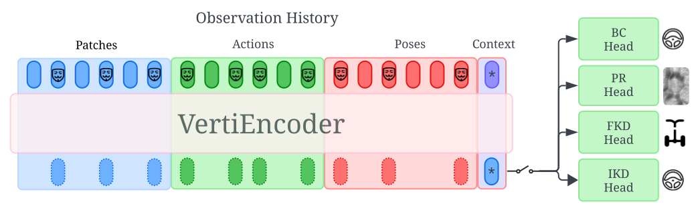

# [VertiEncoder: Self-Supervised Kinodynamic Representation Learning on Vertically Challenging Terrain](https://arxiv.org/abs/2409.11570)
[](https://opensource.org/licenses/MIT)
[](https://robotixx.cs.gmu.edu/)

[Mohammad Nazeri](https://mhnazeri.github.io/), [Aniket Datar](https://datar-aniket.github.io), [Anuj Pokhrel](https://anujpokhrel.github.io/), Chenhui Pan, Garrett Warnell, and [Xuesu Xiao](https://cs.gmu.edu/~xiao/)
<hr style="border: 2px solid gray;"></hr>

**Notice:** The improved implementation of VertiEncoder is now in [VertiFormer](https://github.com/mhnazeri/VertiFormer) repository. For reference implementation, please refer to the the new repository.

The official PyTorch implementation of "VertiEncoder: Self-Supervised Kinodynamic Representation Learning on Vertically Challenging Terrain".

<p align="center">
  
</p>


## Installation
Main libraries:
* [PyTorch](https://www.pytorch.org/): as the main ML framework
* [Comet.ml](https://www.comet.ml): tracking code, logging experiments
* [OmegaConf](https://omegaconf.readthedocs.io/en/latest/): for managing configuration files

First create a virtual env for the project. 
```bash
python3 -m venv .venv
source .venv/bin/activate
```

Then install the latest version of PyTorch from the [official site](htpps://www.pytorch.org/). Finally, run the following:
```bash
pip install -r requirements
pip install -e .
```

## Training
To run pretext training (edit [config](vertiencoder/conf/transformer.yaml) first) then run:
```bash
./run.sh train
```

To run downstream task, edit [config](vertiencoder/conf/dt.yaml) for the downstream name (options: ['bc', 'fkd', 'ikd']) and then run:
```bash
./run.sh train_dt
```